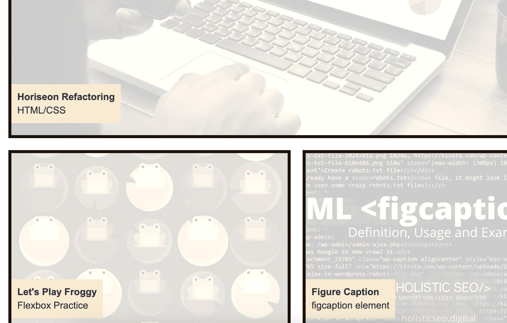

# Jonathan Fadera Portfolio

## Description

A portfolio of work can showcase my skills and talents to employers looking to fill a part-time or full-time position. An effective portfolio highlights my strongest work as well as the thought processes behind it.

With these points in mind, I am setting myself up for future success by applying the core skills that I've recently learned: flexbox, media queries, and CSS variables. I get to practice my new skills while creating something that I'll be using during my job search. 

## Table of Contents

- [Usage](#usage)
- [Credits](#credits)

## Usage

## Deployed Application Link

https://jonathanfadera.github.io/eFolio/

## Credits

https://docs.emmet.io/cheat-sheet/ :tools for using syntax

https://ucb.bootcampcontent.com/UCB-Coding-Bootcamp/UCB-VIRT-FSF-PT-01-2023-U-LOLC/-/tree/main/Week_02-Advanced-CSS/01-Activities : Class Modules for Advanced CSS

https://www.w3schools.com/howto/howto_css_clearfix.asp : site for clear fixes for CSS

https://flexboxfroggy.com/ : site for flexbox

https://developer.mozilla.org/en-US/docs/Web/HTML/Element/figcaption : site for figure caption

https://github.com/apyosi : repurposed some codes ; inspired by the opacity hovering framework

https://www.freecodecamp.org/news/how-to-open-a-link-in-a-new-tab/ : how to open a link in a new tab