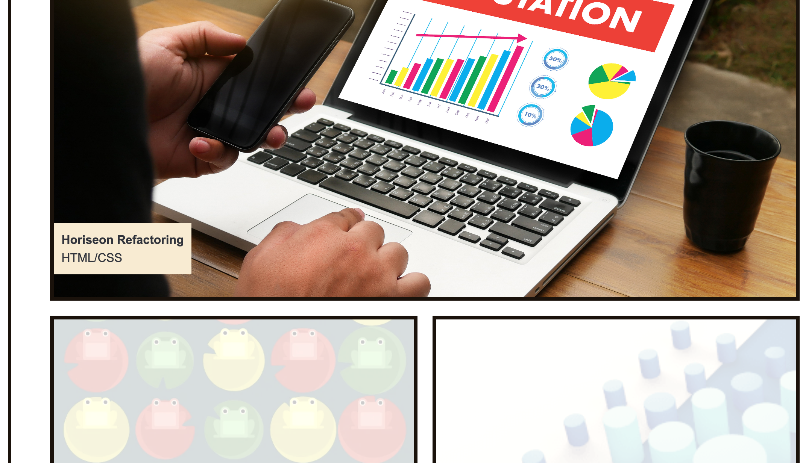

# Jonathan Fadera Portfolio

## Description

A portfolio of work can showcase my skills and talents to employers looking to fill a part-time or full-time position. An effective portfolio highlights my strongest work as well as the thought processes behind it.

With these points in mind, I am setting myself up for future success by applying the core skills that I've recently learned: flexbox, media queries, and CSS variables. I get to practice my new skills while creating something that I'll be using during my job search. 

## Table of Contents

- [Usage](#usage)
- [Credits](#credits)

## Usage

## Credits

https://github.com/apyosi

https://ucb.bootcampcontent.com/UCB-Coding-Bootcamp/UCB-VIRT-FSF-PT-01-2023-U-LOLC/-/tree/main/Week_02-Advanced-CSS/01-Activities

https://www.w3schools.com/howto/howto_css_clearfix.asp

https://flexboxfroggy.com/
